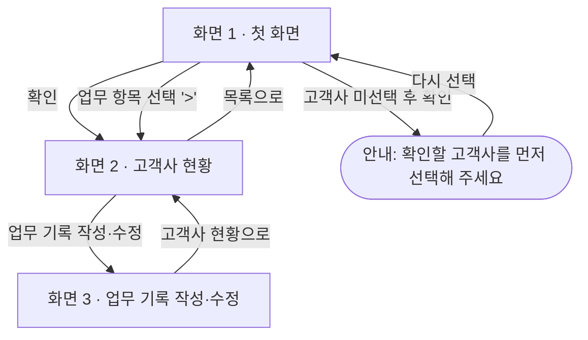

# 화면 흐름도

```mermaid
flowchart TD
    S1["화면 1 · 첫 화면"]
    S2["화면 2 · 고객사 현황"]
    S3["화면 3 · 업무 기록 작성·수정"]
    E(["안내: 확인할 고객사를 먼저 선택해 주세요"])

    S1 -->|확인| S2
    S1 -->|업무 항목 선택 '>'| S2
    S1 -->|고객사 미선택 후 확인| E
    E -->|다시 선택| S1
    S2 -->|업무 기록 작성·수정| S3
    S2 -->|목록으로| S1
    S3 -->|고객사 현황으로| S2
```

화면을 이동하지 않는 동작

- "저장"(화면 3) : 입력한 기록을 저장하며, 화면은 그대로 화면 3에 머문다.
- "경로 복사"(화면 2) : 파일 위치 경로를 복사하며, 화면은 그대로 화면 2에 머문다.
- "+ 새 기록 작성"(화면 3) : 입력 칸을 비워 새로 쓸 수 있게 하며, 화면은 그대로 화면 3에 머문다.
